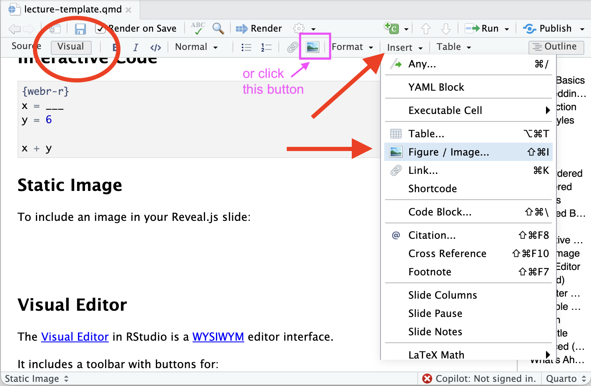
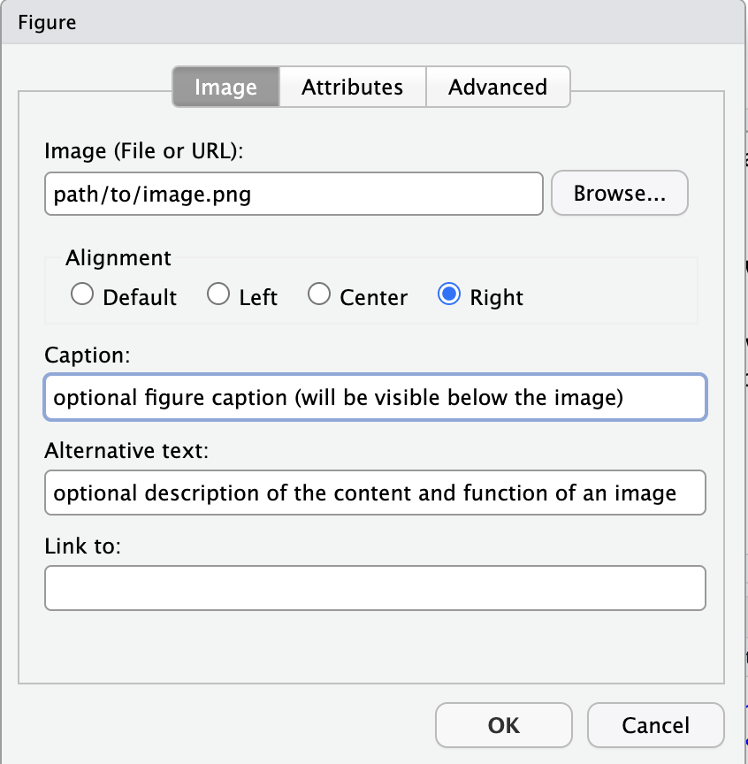
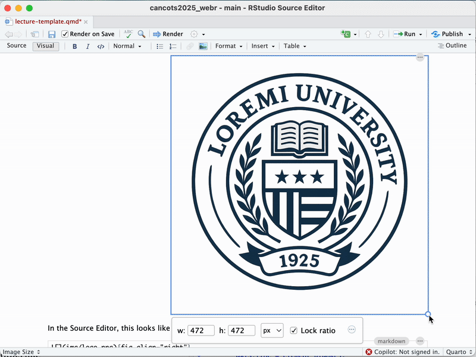

## Outline

Here you can link to certain slides for navigation[^1]

[^1]: You can either use Markdown with slide title name, e.g. [Slide Title](#custom-slide), link to the generated `id`, e.g. [go to code slide](#code), [go to image slide](#static-image), or link to a custom `id`, e.g. [Custom Link](#custom-slide)

::::: columns
::: {.column width="50%"}
#### The Basics

- [Text formating](#font-styles)
- ...
- [Images](#static-image)
:::

::: {.column width="50%"}
#### Imbedding Code:

- [Code](#code)
- [Interactive Code]
:::
:::::

## Introduction

These slides are created using `revealjs` format in Quarto.

. . .

We've highlighted many of the useful and cool features, but you can explore even more on the [Quarto website](https://quarto.org/docs/presentations/revealjs/):

- [revealjs (Presentations in Quarto)](https://quarto.org/docs/presentations/revealjs/)
- [Authoring in Quarto (markdown basics & content formatting)](https://quarto.org)
- [Quarto: The Definitive Guide (a book about Quarto created using Quarto](https://quarto-tdg.org/)

## Font Styles {#font-styles}

*italics*, **bold**, ***bold italics***, ~~strikethrough~~, `monospaced`

::: {style="font-size: 150%;"}
Bigger font
:::

::: {style="font-size: 50%;"}
Smaller font
:::

::: {style="color: red;"}
This text will appear red.
:::

This is line [green]{style="color:green;"} text.

## Math

You can write mathematical equations using LaTex

- e.g. `$f(y) = x^2$` renders to $f(y) = x^2$

You can center math on its own line using double dollar signs, e.g. `$$f(y) = x^2$$` renders to:

$$f(y) = x^2$$

## Tables

| Syntax    | Appearance | Usage                         |
|-----------|------------|-------------------------------|
| `$...$`   | Inline     | For short expressions in text |
| `$$...$$` | Display    | For emphasizing key equations |

: *Table caption: Math syntax summary*

## Lists

:::::: columns
::: {.column width="33%"}
#### Unordered

- fruit
  - apples
  - bananas
- vegetables\
:::

::: {.column width="33%"}
#### Ordered

1.  one

2.  two

    a.  alpha
    b.  beta
:::

::: {.column width="33%"}
#### Tasks

- [ ] Task 1
- [x] Task 2
- [ ] Task 3
:::
::::::

::: aside
🔗 <https://quarto.org/docs/authoring/markdown-basics.html#lists>
:::

## Animated Bullets

You can create [incremental lists](https://quarto.org/docs/presentations/revealjs/#incremental-lists) using the `incremental` div.

:::::: columns
::: {.column width="50%"}
**Source**

``` markdown
::: incremental
-   la
-   la
-   land
:::
```
:::

:::: {.column width="50%"}
**Rendered**

::: incremental
- la
- la
- land
:::
::::
::::::

. . .

**Note**: You can also enable this for all lists by default:

``` yaml
format:
  revealjs:
    incremental: true   
```

## Writing Code {#code}

To include runnable code in Quarto, use fenced code blocks with the appropriate language engine:

```{r}
#| echo: fenced

# Load data
data(mtcars)

# Fit linear model
model <- lm(mpg ~ wt + hp, data = mtcars)
```

- Use three backticks followed by `{r}` to start an R code block.
- You can add [Chunk Options] after `#|`, one per line.

## Chunk Options

These control how code blocks behave:

- `echo: true/false` – Show or hide the source code.

- `eval: true/false` – Evaluate the code or not.

- `code-fold: true/false` – Allow the code block to be collapsible.

- `code-summary: "text"` – Customize label for folded code.

::: aside
These are just a few popular examples—Quarto supports more chunk options.

➡️ Full reference: <https://quarto.org/docs/computations/execution-options.html>
:::

## Example: Code Folding

See the next slide for the rendered output ...

```{{r}}
#| echo: true
#| code-summary: "Click me to show the code!"
#| code-fold: true

library(ggplot2)
dat <- data.frame(cond = rep(c("A", "B"), each=10),
                  xvar = 1:20 + rnorm(20,sd=3),
                  yvar = 1:20 + rnorm(20,sd=3))

ggplot(dat, aes(x=xvar, y=yvar)) +
  geom_point(shape=1) + 
  geom_smooth() 
```

## Example: Code Folding

```{r}
#| code-fold: true
#| code-summary: "Click me to show the code!"
#| echo: true

library(ggplot2)
dat <- data.frame(cond = rep(c("A", "B"), each=10),
                  xvar = 1:20 + rnorm(20,sd=3),
                  yvar = 1:20 + rnorm(20,sd=3))

ggplot(dat, aes(x=xvar, y=yvar)) +
  geom_point(shape=1) + 
  geom_smooth() 

```

## Example: Code Hiding

Setting `echo: false` hides the code and shows only the output.

```{{r}}
#| echo: false

library(ggplot2)
dat <- data.frame(cond = rep(c("A", "B"), each=10),
                  xvar = 1:20 + rnorm(20,sd=3),
                  yvar = 1:20 + rnorm(20,sd=3))

ggplot(dat, aes(x=xvar, y=yvar)) +
  geom_point(shape=1) + 
  geom_smooth() 
```

See the next slide for the rendered output ...

## Example: Code Hiding

```{r}
#| echo: false


library(ggplot2)
dat <- data.frame(cond = rep(c("A", "B"), each=10),
                  xvar = 1:20 + rnorm(20,sd=3),
                  yvar = 1:20 + rnorm(20,sd=3))

ggplot(dat, aes(x=xvar, y=yvar)) +
  geom_point(shape=1) + 
  geom_smooth() 
```

## Code Copying

All code blocks include a clipboard icon by default. Hover and click to copy the code.

```{r}
#| echo: true
#| eval: false

library(ggplot2)
dat <- data.frame(cond = rep(c("A", "B"), each=10),
                  xvar = 1:20 + rnorm(20,sd=3),
                  yvar = 1:20 + rnorm(20,sd=3))

ggplot(dat, aes(x=xvar, y=yvar)) +
  geom_point(shape=1) + 
  geom_smooth() 
```

## Output Location {#output-location .smaller}

By default, the output will follow immediately after the code. Use `output-location` to control where the output appears:

| `output-location` | Description |
|--------------------------|----------------------------------------------|
| `fragment` | Output appears as a fragment—revealed when you advance the slide |
| `slide` | Output appears on the **next** slide, separate from the code |
| `column` | Code and output shown side‑by‑side in two equal-width columns on one slide |
| `column-fragment` | Same as `column`, but output is delayed as a fragment |

## Adjusting Slide Size

The table didn’t quite fit on the previous slide, so we use the `.smaller` CSS class to reduce the font size for the entire slide. Here’s what’s happening under the hood:

```{verbatim}
## Normal Slide

This is normal size text.

## Smaller Slide {.smaller}

This text will be smaller so more fits on the slide.
```

## Example: Default (output after code)

```{r}
#| echo: true

ggplot(dat, aes(x=xvar, y=yvar)) +
  geom_point(shape=1) + 
  geom_smooth() 
```

## Example: Output on next slide

```{r}
#| echo: fenced
#| output-location: slide

ggplot(dat, aes(x=xvar, y=yvar)) +
  geom_point(shape=1) + 
  geom_smooth() 

```

## Example: Column

```{r}
#| echo: fenced
#| output-location: column

ggplot(dat, aes(x=xvar, y=yvar)) +
  geom_point(shape=1) + 
  geom_smooth() 

```

## Example: Resize figure

```{r}
#| echo: fenced
#| output-location: column
#| fig-width: 4
#| fig-height: 3
#| out-width: "100%"

ggplot(dat, aes(x=xvar, y=yvar)) +
  geom_point(shape=1) + 
  geom_smooth() 

```

## Interactive Code

```{webr-r}
x = ___
y = 6

x + y
```

## Static Image {#static-image}

The basic syntax for including an image is:

``` markdown

```

Which renders to: (jump [here](#resizing) for more image options)

](img/logo.png)

## Presenter Notes

You can create presenter notes using div with the `notes` class

``` markdown
::: notes
This is how you include presenter notes
:::
```

Read this in [Speaker View](https://quarto.org/docs/presentations/revealjs/presenting.html#speaker-view) by pressing the  key (give it a try!)

::: callout-warning
If you are publishing your HTML slides, your students can also gain access to the presenter notes by pressing `S`.
:::

::: notes
This is how you include presenter notes
:::

## Scrollable Slides {.scrollable}

The `.scrollable` class makes overflow content scrollable vertically rather than being cut off.

You can acheive it using:

``` markdown
## Slide Title {.scrollable}
```

This is especially useful when you have:

- Long code blocks
- Large tables
- Verbose output
- Lists or explanations that extend beyond the slide height

## Example without using scrollable

Below is a long list of repeated text to demonstrate how text will get cut off without using scrollable 😞

- Line 1: You can't scroll down to see more\
- Line 2: You can't scroll down to see more\
- Line 3: You can't scroll down to see more\
- Line 4: You can't scroll down to see more\
- Line 5: You can't scroll down to see more\
- Line 6: You can't scroll down to see more\
- Line 7: You can't scroll down to see more\
- Line 8: You can't scroll down to see more\
- Line 9: You can't scroll down to see more\
- Line 10: You can't scroll down to see more\
- Line 11: You can't scroll down to see more\
- Line 12: You can't scroll down to see more\
- Line 13: You can't scroll down to see more\
- Line 14: You can't scroll down to see more\
- Line 15: You can't scroll down to see more\
- Line 16: You can't scroll down to see more\
- Line 17: You can't scroll down to see more\
- Line 18: You can't scroll down to see more\
- Line 19: You can't scroll down to see more\
- Line 20: You can't scroll down to see more

## Example using scrollable {.scrollable}

Below is a long list of repeated text to demonstrate scrolling in action 🥳

- Line 1: Scroll down to see more\
- Line 2: Scroll down to see more\
- Line 3: Scroll down to see more\
- Line 4: Scroll down to see more\
- Line 5: Scroll down to see more\
- Line 6: Scroll down to see more\
- Line 7: Scroll down to see more\
- Line 8: Scroll down to see more\
- Line 9: Scroll down to see more\
- Line 10: Scroll down to see more\
- Line 11: Scroll down to see more\
- Line 12: Scroll down to see more\
- Line 13: Scroll down to see more\
- Line 14: Scroll down to see more\
- Line 15: Scroll down to see more\
- Line 16: Scroll down to see more\
- Line 17: Scroll down to see more\
- Line 18: Scroll down to see more\
- Line 19: Scroll down to see more\
- Line 20: Scroll down to see more

## Example: Scrollable Figure

::: callout-tip
`.scrollable` is useful when you have interactive code where students are expected to achieve a specific output that may otherwise be cut off due to limited slide space.
:::

Q1. Change the points from circles to triangles (after running you will need to scroll down to see the resulting plot)

```{webr-r}
#| echo: true
library(ggplot2)

# Create the scatter plot
ggplot(data = mtcars, aes(x = hp, y = mpg, color = as.factor(cyl))) +
  geom_point(size = 3) +
  labs(
    title = "MPG vs Horsepower",
    x = "Horsepower (hp)",
    y = "Miles Per Gallon (mpg)",
    color = "Cylinders"
  ) +
  theme_minimal()

```

## Smaller Slides

The `.smaller` class---used in the same way as `.scrollable`--- reduces the base font size for the entire slide, excluding the slide title.

``` markdown
## Normal Slide

This is normal size text.

## Smaller Slide {.smaller}

This text will be smaller so more fits on the slide.
```

An example of this can be seen on [this](#output-location) slide.

## Cross-referencing slides

- Given the following slide title, Quarto will automatically generate the ID: of `my-amazing-slide`.[^2]

  ``` markdown
  ## My Amazing Slide! 
  ```

- To reference that slide we can use

  - `[this slide](#my-amazing-slide)`, e.g. [this slide](#output-location)

  - `[My Amazing Slide!]`, e.g. [Output Location](#output-location)

[^2]: Special characters are removed, spaces become dashes, and uppercase letters are converted to lowercase.

## Custom Titles

If you want to make a custom-id, use:

``` markdown
## This slide title is too long {#short-id}
```

and reference using:

``` markdown
[link](#short-id) 
```

::: notes
Quarto auto-generates heading IDs (like Pandoc) by: converting to lower case, removing punctation and replacing spaces with hyphens

How to manually assign IDs using {#my-id}

How these IDs can be used as anchors

This slide is here to show how to make custom slide `id`s
:::

## Callouts

::: callout-tip
There are five types of callouts, including: `note`, `warning`, `important`, `tip`, and `caution`; see [Callout Blocks](https://quarto.org/docs/authoring/callouts.html)
:::

::: {.callout-tip icon="false"}
## Tip with Title

This is an example of a callout with a (non-default) title and the lightbulb icon disabled.
:::

::: callout-note
If you do not specify a title it will default to the name of the callout type.
:::

::: {.callout-warning appearance="simple"}
A "simple" appearance `warning` callout (retains icon)
:::

::: {.callout-important appearance="minimal"}
A "minimal" appearance `important` callout (supresses icon)
:::

# Advanced Features

## Whats Ahead

The above should be more than you need to get started creating presentations in your course. If you're building more customized or interactive slides, we cover:

- Fragments & animations
- Slide state events
- Custom keyboard bindings
- Code execution and plugins
- Embedding other HTML/JS content

## Code highlighting

In addition to the HTML Code Block options, revealjs supports the ability to do line highlighting. This is accomplished using:

``` r
#| code-line-numbers: "1-2|4-5|7-8"
```

```{r}
#| code-line-numbers: "1-2|4-5|7-8"
#| echo: true
#| eval: false

# Load data
data(mtcars)

# Fit linear model
model <- lm(mpg ~ wt + hp, data = mtcars)

# Summary output
summary(model)  
```

::: aside
See [Quarto: Line Highlighting](https://quarto.org/docs/presentations/revealjs/#line-highlighting)
:::

## Code Annotation

Much like footnotes, we could use [Code Annotations](https://quarto.org/docs/authoring/code-annotation.html) to attach explanation to lines of code.

```{r}
#| echo: true
#| eval: false
library(tidyverse)
library(palmerpenguins)
penguins |>                                      # <1>
  mutate(                                        # <2>
    bill_ratio = bill_depth_mm / bill_length_mm, # <2>
    bill_area  = bill_depth_mm * bill_length_mm  # <2>
  )                                              # <2>
```

1.  Take `penguins`, and then,
2.  add new columns for the bill ratio and bill area.

::: aside
Source: <https://quarto.org/docs/authoring/code-annotation.html>
:::

## Code Animations {auto-animate="true"}

You can also animate between code blocks to show changes in code. For example:

``` r
# Define a server for the Shiny app
function(input, output) {
  
  # Fill in the spot we created for a plot
  output$phonePlot <- renderPlot({
    # Render a barplot
  })
}
```

## Code Animations II {auto-animate="true"}

You can also animate between code blocks to show changes in code. For example:

``` r
# Define a server for the Shiny app
function(input, output) {
  
  # Fill in the spot we created for a plot
  output$phonePlot <- renderPlot({
    # Render a barplot
    barplot(WorldPhones[,input$region]*1000, 
            main=input$region,
            ylab="Number of Telephones",
            xlab="Year")
  })
}
```

::: footer
Learn more: [Code Animations](https://quarto.org/docs/presentations/revealjs/advanced.html#code-animations)
:::

## Visual Editor

The [Visual Editor](https://quarto.org/docs/visual-editor/) (VE) (as opposed to the Source Editor) in RStudio is a [WYSIWYM](https://en.wikipedia.org/wiki/WYSIWYM) editor interface.

It includes a toolbar with buttons and menu options for:

- formatting text (bold, italics, headers, lists)

- inserting tables, images

- hyperlinks,

- and more!

**Bonus**: It also provides previews of rendered math, plots, and supports the execution of code cells.

## Figures/Images using VE

Quarto supports a number of ways to include figures and subfigures into your documents; see [Quarto:Figures](https://quarto.org/docs/authoring/figures.html).



## Figure Options

{fig-align="center"}

## Right-aligned Image

For demonstration we make our image left-aligned.

{fig-align="right"}

In the Source Editor, the markdown syntax is:

``` markdown
{fig-align="right"}
```

## Resizing in Markdown (Source Editor) {#resizing}

You can resize images using the `{}` attribute list syntax directly after the image. e.g.

``` markdown
{width=150px}
```

You can also use other units:

``` markdown
{width=50%}
```

You can combine it with alignment:

``` markdown
{fig-align="right" width=150px}
```

## Resizing in Visual Editor

- In VE you can resize an image by clicking and dragging its corner handles.

- By default, the aspect ratio is locked. You can disable this and adjust dimensions independently.

- See the next slide for a demonstration

## 

.

## Videos

You can embed videos in documents using `{}` the shortcode; see [Quarto: videos](https://quarto.org/docs/authoring/videos.html)

. . .

For example, here we embed a YouTube video (see the rendered output on the following slide):

``` {.markdown .code-no-line-numbers shortcodes="false"}

```

## 



## iFrame

You can also embed videos/webpages using an iFrame

<iframe width="560" height="315" src="https://www.youtube.com/embed/t0GTLC0ou6A?si=YBO5KzFjWv_NM4uA" title="YouTube video player" frameborder="0" allow="accelerometer; autoplay; clipboard-write; encrypted-media; gyroscope; picture-in-picture; web-share" referrerpolicy="strict-origin-when-cross-origin" allowfullscreen>

</iframe>

::: callout-note
Some websites block `iframe`, so previews may not appear in the rendered Quarto output for those sites.
:::
